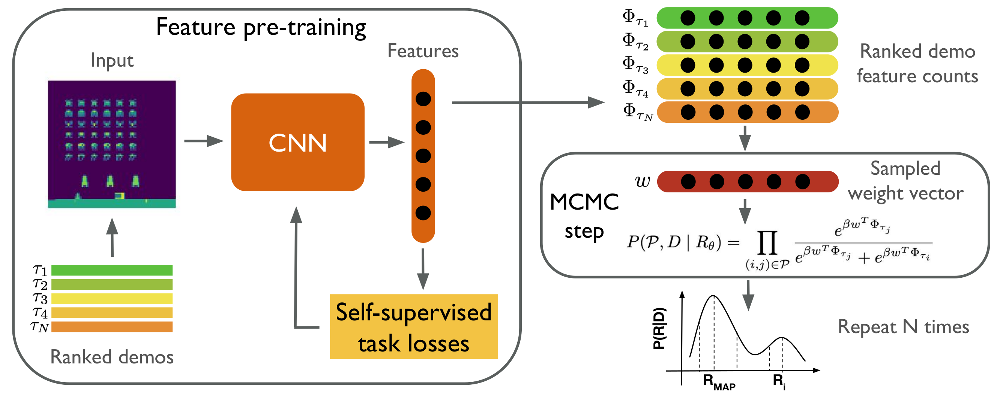
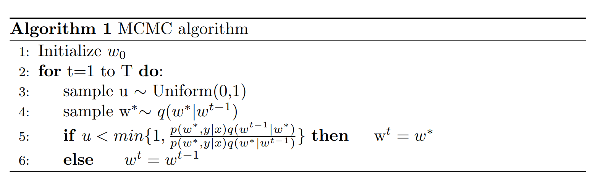
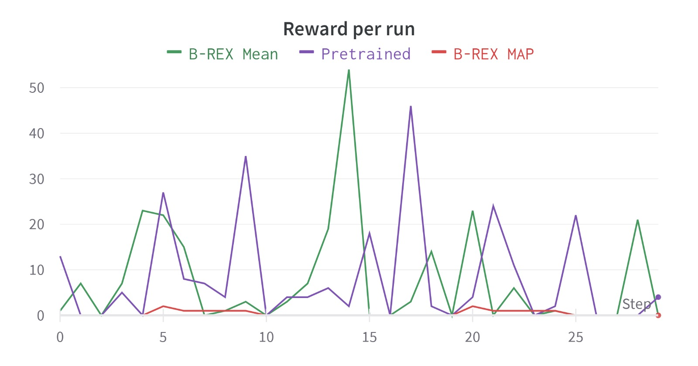
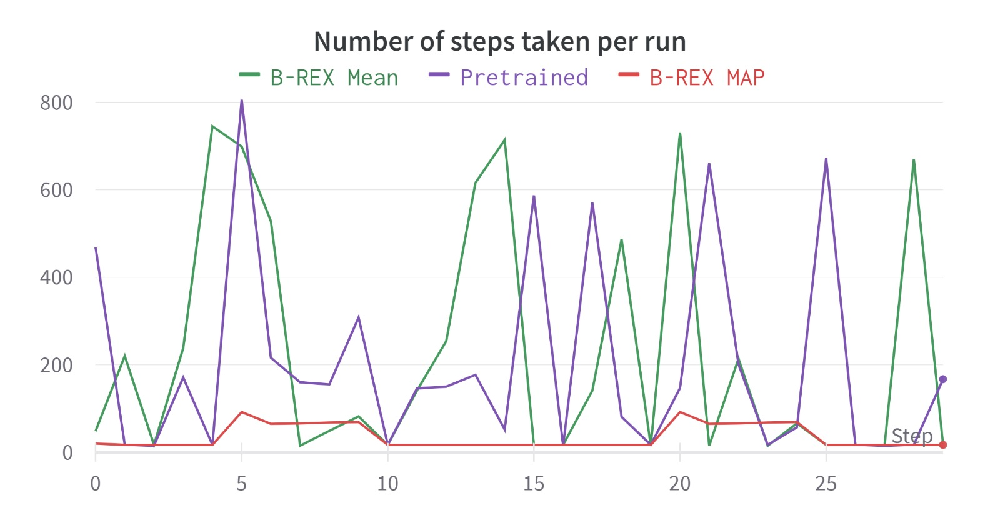
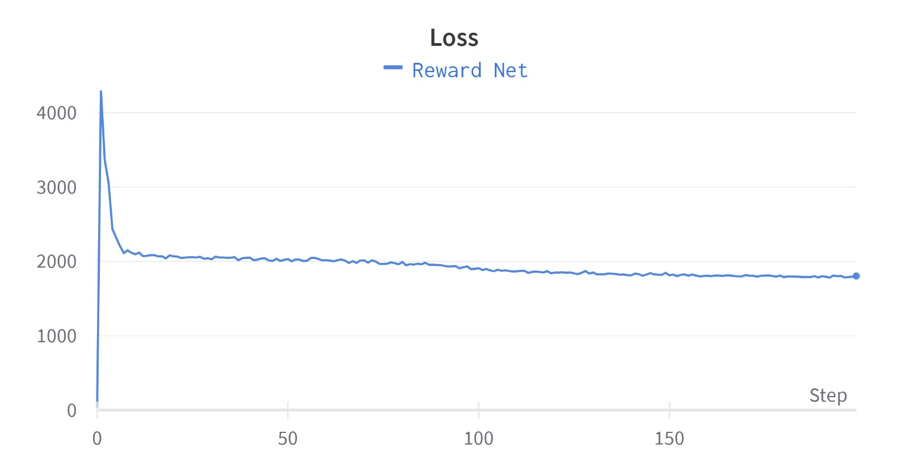

# A Study on Risk Evaluation in Imitation Learning
## Re: *Safe Imitation Learning via Fast Bayesian Reward Inference from Preferences*

Team 18: Darie Petcu, David Frühbuss, Marco Gallo, Marga Don, Satchit Chatterji

# Introduction
As deep reinforcement learning (RL) becomes more sophisticated, so does the potential for its use in various real-life applications. However, in safety-critical applications, it is becoming clear that one important aspect of guaranteeing the safety of an RL system is *uncertainty quantification*, i.e. a bounded confidence value of a system over its predictions (Amodei et al, 2016, Lutjens et al, 2019).

Building upon recent advancements in uncertainty quantification in this field, the project presented here is based on the paper "*Safe Imitation Learning via Fast Bayesian Reward Inference from Preferences*" by Brown, Coleman, Srinivasan and Niekum (2020). This study proposes Bayesian Reward Extrapolation (Bayesian REX), an imitation learning algorithm that uses ranked demonstrations and Markov Chain Monte-Carlo (MCMC) to efficiently sample a learnt reward function from a pretrained network. This reward function can then be used to train high performing reinforcement learning agents. Because of the efficiency of Bayesian REX, the authors are able to use high dimensional environments like Atari games for their demonstrations.

In the project discussed here, we walk you through several aspects of the paper and our journey recreating and extending it. From a practical standpoint, the codebase that Brown et al (2020) provide was quite outdated for our needs, and a discussion about how we modernized it is an important part of our blog. However, as you will see, we could not replicate their results for a number of speculated reasons. This paper does elicit some interesting research directions, including several exploratory questions about optimizing and learning about uncertainty quantification in imitation learning, and more practical ones too, such as its use in safety applications such as automatic reward hacking detection. We offer future researchers reading this a clean, well-documented and working pipeline, a few additional extensible building blocks in the code, as well as several ideas where to go next.

We begin this blogpost by introducing the key concepts, as well as some basic notions about them, in case the reader is unfamiliar with these terms. With this in mind, we then analyse the original paper (Brown et al, 2020) from a theoretical and code perspective. In the next section, we discuss our novel contributions that build upon the original and our experiences doing so. Then, we discuss about our experiments and results. The final short section discusses our individual contributions. 

# Key Concepts
**Reinforcement Learning** is an artificial intelligence paradigm where an agent learns to complete a task based on positive and/or negative rewards received when attempting that task (Sutton & Barto, 2020). The agent specifically learns a 'policy', that is, the behaviour of an agent given an environment. More formally, a policy $\pi$ is a mapping from the set of states $\mathcal{S}$ and the set of available actions $\mathcal{A}$ to an action $a$, that ideally maximises the expected reward over the whole episode (a series of states and actions that lead to a certain goal or terminal state). The `reward' is formalised as a function from $\mathcal{S}$ to $\mathbb{R}$ that gives the agent a real valued utility at a given state. The expected reward is the summed rewards that the agent gathers at each timestep from some initial time $t_0$ to the end of the episode $t_n$ (which can be when the agent reaches some terminal state, or when a predefined number of time steps have passed).

**Imitation Learning** aims to use demonstrations for learning policies, generally when the reward function is not available to the RL agent. It can be split into **behavioral cloning** and **inverse reinforcement learning** (Zheng et al., 2022). Without going into too much detail, the prior is a supervised learning problem, in which a mapping is learnt from states to actions that directly copies the demonstrator. The latter first aims to learn the hidden reward function that the demonstrator is trying to optimize, and then train an RL agent on the learnt reward function.

**Markov Chain Monte Carlo (MCMC)** is a method that is used here to enable the training of **Bayesian neural networks** (BNNs) by sampling from the posterior distribution. Unlike traditional training methods that are designed to use point estimates, MCMC methods capture uncertainty by treating model parameters as random variables, thus learning parameter distributions instead. By iteratively sampling from the posterior distribution using techniques like Hamiltonian Monte Carlo (Betancourt, 2017), uncertainty in the data may be quantified, and instead of predicting point estimates, as normal neural networks do, we can make probabilistic predictions. 


# Original Paper Overview
In this section, we discuss the work of the authors, both on the theoretical (research paper) and practical (coding pipeline) level. This lays the foundation needed to explain our contributions to this project, as well as our design choices. The pipeline is illustrated below, figure credits (Brown et al. 2019).


<p align=center>
  
</p>


## Theoretical analysis

The main work the authors build upon is **Trajectory Reward Extrapolation (T-REX)** (Brown et al. 2019). This inverse RL method uses pairwise rankings of demonstrations in order to learn policies. Thus, the reward function learning task is transformed into a binary classification problem (predicting which of the two policies is better). Thus, in this paper, Brown et al. propose **Bayesian Reward Extrapolation (Bayesian REX)**, an improved T-REX, which is not limited to only solving point estimates of the reward function, rather, it gives a probability distribution over a learnt reward function. A key contribution of the B-REX paper was making demonstration likelihoods tractable. A likelihood $P$ for a set of demonstration state-action pairs $(s,a)\in D$ under a reward function $R$ is defined by the following formula:

```math
P(D|R) = \prod_{(s,a)\in D}\pi^{\beta}_{R}(a|s) = \prod_{(s,a)\in D} \frac{e^{\beta Q^{*}_{R}(s,a)}} {\sum_{b \in A} e^{\beta Q^{*}_{R}(s,b)}}
```

This equation includes the optimal Q-values $Q^{*}_{R}(s,a)$ (which represent the `goodness' of a state-action pair under reward $R$) which would require solving the Markov Decision process (MDP) analytically or sufficiently approximating it, both of which are computationally prohibative on bigger MDPs. The paper instead builds a pairwise ranking likelihood function, where we approximate the total demonstration likelihood by the reward function's ability to distinguish the true pairwise order of the demonstrations:

```math
P(D,P|R_{\theta}) = \prod_{(i,j)\in D} \frac{e^{\beta R_{\theta}(\tau_i)}} {e^{\beta R_{\theta}(\tau_i)} + e^{\beta R_{\theta}(\tau_j)}}
```

where $R_{\theta}$ is a neural network that is trained to maximize this likelihood, $\tau_i$ and $\tau_j$ is a pair of trajectories sampled from the demonstrations and $\beta$ is the inverse temperature parameter that models the confidence in the preference label.

## Extending T-REX to Bayesian framework

In order to obtain the posterior over reward functions the authors apply Monte Chain Monte Carlo sampling (MCMC). MCMC is computationally expensive. Runnig it for the entire reward network for $m$ demonstrations of lenth $T$ would requirte $O(mT)$ forward passes through the entire model at each MCMC step. For the entire MCMC search this would result in $O(mT N|R_\theta|)$ computations, where $N$ is number of MCMC steps and $|R_\theta|$ the compuational cost of a forward pass.

Thus, in order to make MCMC compuationally feasible the authors first pretrain the model using 4 additional self supervised losses on top of the ranking loss. Then they only apply MCMC search to the last linear layer, while keeping the rest of the model frozen. This dramatically reduces the computational cost, because we are able to cache the feature matrix $\Phi_{\tau} \in \mathbb{R^{k}}$ for each trajectory. This reduces the compuational complextity to $O(mT |R_\theta| + mkN)$, because we only need to perform $O(mk)$ additional multiplications per step. This is feasible because the feature dimension $k$ and number of demonstrations $m$ are much smaller than the number of MCMC steps $N$ that we want to perform and the compuational cost of the forward pass $|R_\theta|$.

This does reduce the time it takes to generate 100.000 MCMC steps to about 3.5 min on an Intel i7 Laptop with a RTX 3600 Graphic card.

###  Strengths
- Building on previous work (T-REX), the pairwise ranking allows for tractable sampling from the reward function posterior.
- Instead of a point estimate, Bayesian REX gives a distribution over reward functions, which allows for more in-depth policy evaluation.
- If the distribution wrongly assigns a high reward value to a poorly performing or otherwise undesirable policy, this can be easily remedied by adding this policy to the data used for MCMC sampling and giving it a low rank. Re-running the MCMC sampling will then give a new distribution which correctly assigns a low reward to this undesirable policy. 
- Policies learned with Bayesian REX are able to achieve rewards much higher than those achieved by the demonstration data the latent features were trained on. For example, in the case of the 'Breakout' game, a policy is learned that gives more than 12x improvement on the highest score in the demonstration data. 

###  Weaknesses
The RL agent can be trained using either the mean or MAP estimate of the reward function. In most cases, the agent trained with the MAP estimate outperforms the agent trained with the mean function, but for the 'Enduro' game the MAP estimate significantly underperforms the mean estimate. The authors do not investigate this behavior.

Another major weakness that we identified was that the code, despite being available, was not well maintained or documented. There were multiple instances of duplicate code, resulting in difficult to follow logical pipelines. 


### Potential Improvements
Here we list all the extension ideas we came up with, along with brief descriptions of how they could be implemented and what findings we hypothesize could come out of these ideas.

* We were intrigued by the performance graph on the different games, and especially by how MAP performance (selecting a policy based on the maximimum of the a-postiori probability distribution of the network approximating a learnt reward function) is very low in Enduro, whereas it results in the best performance for other games. This lead us to believe the reward distribution might be multimodal, and the MAP estimate might fall in its saddle point. This gave us the idea that, by inspecting the estimated reward distribution, we can attempt to **predict or detect whether a game is prone to suboptimal learnt policies**. 

* Another idea we got for the estimated reward function is to incorporate **conformal prediction** into the pipeline, as another way of computing a probability distribution over the reward function. 

* The authors do not provide studies on hyperparameters or architectures of their pipeline, such as the **size of the input embeddings**. In the paper, this defaults to a vector of size 200. We believe a possible extension would be experimenting with multiple changes in these settings, especially the embedding size, and observing changes in performance. This experiment would allow us to reason about what features are being encoded, and how each of them relates to the performance obtained by the model.

* We are also considering to attempt **fine-tuning the embeddings** themselves. We hypothesize this would result in a higher certainty over produced policies, as the embeddings would better represent the game elements and help the algorithm in learning new policies from the demonstrations. 

* In light of the fact that the authors are using a list of demonstrations with global rankings (i.e.\ a strongly ordered preference list), we also see a possible improvement in trying to change the pairwise rankings they use for the demonstrations into **listwise rankings**. This idea is inspired from learning-to-rank literature (i.e.\ a listwise loss such as ListNet (Cao et al, 2007)). The reasoning behind this idea is that including multiple demonstrations within the same preference would help provide more context for the algorithm, increasing the training performance, speed, or both. 

* We notice that in several games in the original paper, the RL agent using the learned reward function outperforms its demonstrator, as evaluated with the true reward function. The policies generated after learning from the demonstrations could also be used for **generating further demonstrations**. We consider a possible improvement would be to use these generated demonstrations to again learn a new reward function and thus an improved policy. This would mean, in a bootstrapping-like manner, that the algorithm would be engaged in self-play and potentially improve even more compared to the initial demonstrations. This may result in finding a saturation point in performance, or may lead the agent to prefer one style of play over any other.

* We also considered labeling the demonstrations in some way, thus **adding causality to the project**. Scaling the model to be able to do **multitask learning** was also discussed.

* The confidence level of evaluated policies, as the paper itself also mentions, may potentially be used for "automatic detection" of *reward hacking*. Reward hacking is an important problem in reinforcement learning and alignment research -- essentially, an agent is 'hacking a reward function' if it creates policies that maximise the defined reward function, but may not align with how the developer expects the agent to play. For example, if the agent finds software glitches that lead to high rewards, or optimize for some interim reward that leads the agent to not complete the overall objective of the task. This is a very exciting prospect, as, to our knowledge, no robust/reliable algorithm has yet been created.  However, it is hard to determine objectively what is and isn't reward hacking (*couldn't software glitches be considered part of the game itself?*). The authors claim that policies with high mean predicted performance and high risk/uncertainty are candidates for reward hacking policies. In their experiments, they specifically design a policy that uses reward hacking, and these traits are what sets it aside from the other tested policies.

## Code explanation
In this section, we explain how the pipeline designed by the authors works, and what role each element plays.

### Pretraining Agents and Generating Demonstrations
To generate the pretrained RL agents, we run a PPO agents with default parameters for 1e7 timesteps, checkpointing each 4e5 timesteps. This allows for a wider range of agents, some that perform badly and some that perform very well. Thus, it means the demonstrations we generate from these agents are of differing quality. This then allows the reward network to learn from a more diverse dataset. 

Generating demonstration data consists largely of two parts: generating the trajectories and generating training data. The trajectories are used as input to the MCMC step, while the training data is used as input for the training of the embedding network. 

**Generating trajectories**
In this step, each agent checkpoint is used to generate one trajectory (this number can be increased). This is done by letting the agent play the game and collecting the observations, actions and rewards the agent gets along the way. %marco what exactly happens during the create_training_data step?

### Reward-Learning Neural Network
The neural network learns to estimate the reward function by training on pairs of demonstrations. The architecture of the network consists of four Convolutional layers, with Leaky ReLU activation layers after each of them. The last layer of the network is Fully Connected. The output is the cumulative reward over a whole trajectory, as estimated by the network. During this training, a trajectory has a shape of [N, 84, 84, 4], where each frame has a size of [84, 84, 4] and N is the amount of frames, which representes the length of the trajectory. Thus, N can be seen as a batch dimension. 

During training, the pairwise demonstrations are used. At each step, the network outputs estimated rewards for two trajectories. The ground truth contains information about which trajectory is better, i.e. has a larger cumulative reward. Several losses are used to train the network, the first is the T-Rex loss and the others are self-supervised losses.

- A CrossEntropy loss, between the cumulative rewards of the two trajectories. The loss checks if the better trajectory's reward has been correctly estimated as the larger one.
- A forward dynamics loss, which, given the encodings of the first n frames, predicts the encodings of the frames afterwards and compares them against their actual encodings. 
- An inverse dynamics loss, which estimates actions taken from the concatenation of state encodings, and compares them to the actual actions taken using cross entropy loss
- A temporal distance loss, which, given two random states from the same trajectory, predicts the temporal difference between them.
- A reconstruction loss, which uses a decoder structure to predict the pixel values from an embedding and compares these against the real pixel values. 

### Markov Chain Monte-Carlo
In this step, the last layer of the embedding network is 're-trained' using MCMC to obtain a MAP estimate of the final layer. To do so, all layers but the last are frozen and the last layer is randomly re-initialized. Furthermore, new demonstrations are generated to ensure this step uses different data than the pre-training of the embedding network. To allow efficient processing, the demonstration data can be run through the embedding network to obtain only the embeddings, which remain constant during this step. Then, the embeddings can simply be multiplied with the current state of the last layer to gain the reward estimates. 
During an MCMC step, the current state of the last layer is slightly adjusted and the pairwise ranking loss is recomputed. This involves computing the predicted rewards and comparing the predicted preferences to the real preferences. Using a cross-entropy loss, the log likelihood of the current last layer is determined. If this log-likelihood is the highest so far, that state of the last layer is saved as the best. This MCMC step is repeated 2e5 times.


<p align=center>
  
</p>

### Training RL Agents with the Learned Reward function
This step is very similar to the pretraining of the RL agents, except that the agent's reward at each step is now determined by our network instead of what is given by the standard environment. We again run for 1e7 timesteps and checkpoint each 4e5. To evaluate, we run the final agent 30 times and average the rewards achieved. 

# Novel contributions
In this section, we describe which ideas from the Potential Improvements we ended up implementing. It then goes into deeper detail about the work we managed to get done, which consisted of adapting the authors' code and implementing two extensions. The two extensions are a custom reward wrapper, and using listwise preferences. 

## Adapting Authors' Code
The first step we took in this project was to familiarize ourselves with the codebase provided by the authors. Immediately, we encountered a severe issue: the codebase was highly outdated. The authors had used Python 3.6 and a mix of TensorFlow (for training and running of RL agents) and PyTorch (for training of the CNN). Since the RL agents use TensorFlow 1.x, which is outdated and no longer supported by a working CUDA version, it was impossible to generate the demonstrations and train the CNN on a GPU within the same Python environment. Furthermore, the LISA cluster only supports TensorFlow 2.x, which has significant API changes with respect to TensorFlow 1.x. This API difference between TensorFlow versions made porting the code to new versions seem to be a time-consuming task. We decided to split up the files, allowing us to work with two different environments: one in Python 3.6 with the necessary packages for generating demonstrations and training RL agents, and one in Python 3.11 for training the CNN and running the MCMC. 

Aside from the code being outdated, we also found it extremely difficult to work with. It was inefficient and hard to interpret. For example, the CNN was redefined slightly differently every time it was used in another step of the process. Comments were few and far between. Thus, to allow ourselves to work efficiently, we also spent some time getting all of this up to a modern standard. 

After encountering code-related issues along the re-writing process, we managed to arrive at the second-to-last step of the pipeline: training an RL agent with our custom reward function (the result of running MCMC over the last layer of the CNN). We found this step to be computationally infeasible, because it required running in Python 3.6 using TensorFlow. This meant no GPU support was available. Training the agent took a long time, training it for $10\%$ of an entire run took an hour. Since the authors provided the pre-trained agents, we had not previously run an RL agent before and thus we were unaware of this issue. Furthermore, the intermediate training results were not encouraging. We were unsure if this was due to bad training data, our rewriting being incorrect, simply needing to give the RL training more time, or even a combination of these factors. Regardless, we decided we needed a much quicker process anyway in order to enable efficient debugging.

Thus, we set out to upgrade the code to the newest version of packages. This would allow us to run all of our code in PyTorch and on GPU. This task also eventually proved to be harder than expected. The authors mostly used the openai-baselines package for their code. However, instead of installing it via pip and using API calls, the authors had included all the files of the package in their code, and made some changes to them. There was no clear documentation of what the authors had changed, which made upgrading to the newer version of baselines (stable-baselines3, which works on PyTorch instead of TensorFlow) difficult in its own way. We were unsure of what exactly we needed to add ourselves and how. Furthermore, the pre-trained agents provided for generating demonstrations were trained in older versions of the packages. To fully unify the code, we needed to retrain these agents as well.  

Discouraged by the training time we had seen for our custom reward function, we attempted to switch to an easier RL environment. The reasoning was that less time would be needed to train an RL agent. We created a first version using the CartPole environment, one of the most simple RL environments. Unfortunately, since CartPole is a very easy task, the agents we trained in this environment quickly converged to the highest possible score. Since our method heavily relies on ranked preferences, and no preference can be made between two perfect agents, we were unable to use the demonstrations generated by these agents. 

At this point in the process, we only had two weeks left and had not yet gotten any results or been able to really start implementing any extensions. Since the original codebase rewriting was still in progress, it had become clear that our novel contribution was most likely not going to come in the form of a new experiment. Instead, we focused on producing an updated and working version of the authors' codebase, and hoping that some time would be left at the end for a small extension. Thus, we went through the files and rewrote them by keeping the logic consistent, to allow for a sleek, understandable, and modern codebase. For example, we unified the different definitions of the neural networks, made significant improvements to efficiency in the MCMC step, and wrote clear documentation on the whole codebase.

We decided to go back to the Atari environment for two reasons: we wanted to be able to compare our results to the authors', and wanted to prevent the scenario where we work on another environment only to later realise we should switch back to Atari anyway. So, we started working towards generating the pre-trained agents in the Atari environments. After some debugging, we realized the RL agents were not able to train on LISA, nor were we able to generate demonstrations when given a pre-trained agent. We noticed the program seemed to freeze, not giving any output, even with all logging settings enabled. We believe this to be due to a C++ issue on LISA. Thus, we had to train the RL agents on our own devices. We happened to have access to quite powerful laptops in our team, so we were able to train an agent in 5 hours. However, the training of the custom agents involved more computation, namely a pass through our embedding network. This slowed down the training process significantly, making it a 12 hour process. Unfortunately, due to time constraints, we were unable to train an agent with the mean or MAP reward function fully. For evaluation, we picked the farthest checkpoint those agents were both able to reach, which was 3.6e6.
The result of this evaluation can be found in the 'Experiments & Results' section.

Despite the challenges we faced and the limited time available, we made efforts to overcome the obstacles and produce an updated and functional version of the authors' codebase. Here is a summary of the progress we made: retraining pretrained agents in updated packages, updating and thoroughly documenting the entire codebase, switching to modern 'gym' package. 

## Implementing Extensions
The biggest extension we attempted to implement was using Listwise learning on the demonstration preferences. Our approach required modifying some steps of the pipeline, mostly in the data preparation and MCMC part. First, the preferences stored in the dataloader were no longer stored as pairs. Instead, a user-selected number N of demonstrations was sampled from the entire pool of demonstrations to comprise a list of demonstrations. After sorting them on their cumulative returns, the ranked preference lists were ready for training. During training, the model estimates rewards for each of the demonstrations in the list it is currently learning on. These estimated rewards implicitly create a predicted order of the demonstrations: a demonstration with an estimated larger cumulative reward is considered above another demonstration in the list. The predicted order of the demonstrations' rewards is then compared to the ground truth ordering of the demonstrations. Using the LambdaRank algorithm, the contrast between these two orderings of demonstrations is used as a loss to train the network. We hypothesized this larger context window provided to the algorithm would help with training faster, obtaining more information from each training step, or both.

The Listwise extension could not be finalized in time, but the current progress can be inspected on the listwise branch of the repository.

We also implemented a custom reward wrapper, which we managed to complete within the desired timeframe. The custom reward wrapper changes the normal Atari environment reward to the preference reward predicted by our learned reward function at each step. This does increase the training time of the PPO agent considerably because we need to send the environment observation, which are done on CPU, to the GPU and through the forward pass of the reward model and then send them back to CPU for the next step. The training time on an Atari game for 10e6 steps increases from 5 hours to about 12 hours. We managed to integrate the wrapper in a way, that allows us to still use several CPU cores in parallel. Otherwise the evaluation would have taken even longer. We implemented two versions, one for the MAP and the mean of the reward function posterior.

# Experiments \& Results
This section contains details of the experiments we ran and their results.

Due to time constraints, we were able to train an agent in the Breakout environment with the MAP estimate of the reward function (B-REX MAP) and an agent in the same environment with a mean estimate of the reward function (B-REX Mean). We compared this against the Breakout agent trained with the default reward function (Pretrained). However, due to the large training time for RL agents, we were only able to train the custom agents for 3.6e6 timesteps instead of 1e7. We compare the performance of our agents at this checkpoint with the vanilla agent at the same checkpoint in the figures below. 
To compare the agents, we let each agent play the game 30 times (as the authors did) and collected the rewards they achieved. In the first figure, we have plotted the reward gained each run for each agent. In the second figure, we have plotted the amount of steps the agent took in each run.

<p align=center>
  
</p>

<p align=center>
  
</p>

|         | Pretrained agent | | B-REX Mean | B-REX MAP |
|---------| ---------------- |-| ---------- | --------- |
|         | Best    | Avg    | Avg (std)  | Avg (std) |
| **Authors** | 32      | 14.5   | 390.7 (48.8) | 393.1 (63.7) |
| **Us**      | 46      | 8.27   | 7.67 (11.7) | 0.4 (0.611) |

The table above shows our results and the authors results. Per agent type (Pretrained, B-REX Mean and B-REX MAP) we report the average reward achieved during the 30 runs. For the pretrained agent, we also report the maximum reward achieved.

Firstly, we can clearly see our results do not come close to those the authors achieved. There are several possible reasons for this:
1. We were only able to train our agent 36% of the way the authors did. It could be the case that our agent would improve significantly given more training time.
1. The demonstration data we generated was faulty. This itself could be due to two factors. First, the pretrained agent being of bad quality. This seems unlikely, seeing as our pretrained agent in the table above is only trained for 3.6e5 timesteps and gets good performance. Secondly, because of the upgrade to new package versions it is possible that some logic steps have changed, without us changing them on purpose. One example of this is that, when pretraining the embedding network, the score is 'masked'. This means that the pixel values where the score is shown are masked, to make sure the agent does not just learn to make that number increase. However, the authors state their agents were pretrained using 'default parameters' for PPO agents, which does not mask scores. This means that the Pretrained agents could technically learn to not take the behavior of the agent into account, but instead focus on increasing the score which is directly given as pixel values. 
1. The embedding network performance was not high enough. Unfortunately, the authors did not provide details on the performance of their embedding network on its own, so we are not able to compare this. Below, we have attached the loss curve we found when training our embedding network. From this, we can see the loss steadily decreases, which implies that the network did learn. Without something to compare to, however, it is difficult to put our curve into perspective. 

<p align=center>
  
</p>

# Individual Contribution
**Darie**: I mainly focused on the report and other theoretical deliverables of the course. I researched possible extensions in the beginning by reviewing literature. I wrote the initial research proposal and contributed to a good chunk of the blogpost throughout the course. I also worked on implementing the listwise preferences extension, but sadly did not have enough time to finish that. 

**David**: For the early part of the project I focused on researching possible extentions, including adding Causality and extending to a multitask seeting. Later I helped implement the custom reward wrappers for the training with the learned reward function. I also helped debugging the the code pipline and wrote parts of the report about the original paper and the Monte Chain Monte Carlo optimization.

**Marco**: I worked on almost all aspects of the coding process: from trying to apply the ideas of B-REX to classic control environments, to the final porting of the codebase to Stable Baselines 3 and eliminating Tensorflow. I wrote the readme for the GitHub repository, and participated in researching extensions (particularly, conformal prediction) and assessing their feasibility given the available codebase.

**Marga**: I primarily focused on the coding process. First, I split the files to allow for the running of the code with two different environments (one in Python3.6 and one in Python3.11). I also unified the different definitions of the CNN, increased efficiency in the MCMC step, updated some of the codebase to the newer package versions and was the one to run most of the pipeline in the end, which came with its share of last-minute debugging. In the report, I was repsonsible for the 'Adapting the Author's Code' and 'Experiments and Results' sections. 

**Satchit**: I contributed to the project by conducting a comprehensive literature review on reinforcement learning, alignment, and Bayesian networks in order to understand and offer extentions to this project. Additionally, I focused on researching and formalizing the concept of reward hacking, which was to be our primary objective once the code pipeline was complete. I also worked on some of the programming aspects, including a ground-up pipeline rewrite, code documentation, and cleanup. I was responsible for specific parts of the blog post, including *Introduction*, *Key Concepts* and *Potential Improvements*.

# References

Amodei, D., Olah, C., Steinhardt, J., Christiano, P., Schulman, J., \& Mané, D. (2016). Concrete problems in AI safety. arXiv preprint arXiv:1606.06565.

Betancourt, M. (2017). A conceptual introduction to Hamiltonian Monte Carlo. arXiv preprint arXiv:1701.02434.

Brown, D., Goo, W., Nagarajan, P., & Niekum, S. (2019, May). Extrapolating beyond suboptimal demonstrations via inverse reinforcement learning from observations. In International conference on machine learning (pp. 783-792). PMLR.

Brown, D., Coleman, R., Srinivasan, R., & Niekum, S. (2020, November). Safe imitation learning via fast bayesian reward inference from preferences. In International Conference on Machine Learning (pp. 1165-1177). PMLR.

Cao, Z., Qin, T., Liu, T. Y., Tsai, M. F., \& Li, H. (2007, June). Learning to rank: from pairwise approach to listwise approach. In Proceedings of the 24th international conference on Machine learning (pp. 129-136).

Lütjens, B., Everett, M., \& How, J. P. (2019, May). Safe reinforcement learning with model uncertainty estimates. In 2019 International Conference on Robotics and Automation (ICRA) (pp. 8662-8668). IEEE.

Zheng, B., Verma, S., Zhou, J., Tsang, I. W., & Chen, F. (2022). Imitation learning: Progress, taxonomies and challenges. IEEE Transactions on Neural Networks and Learning Systems, 1-16.

